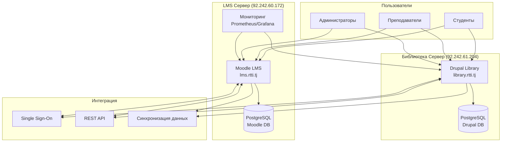

# RTTI LMS Project - Модульная установка систем

Комплексная система управления обучением для Республиканского института повышения квалификации и переподготовки работников в сфере образования имени А. Джоми (RTTI).

## 🎯 Обзор проекта

Данный проект представляет собой интегрированную LMS систему, состоящую из:

- **🎓 Moodle 5.0+** - современная платформа для проведения онлайн-обучения с ИИ инструментами
- **📚 Drupal 11 Library** - цифровая библиотека электронных книг на LTS платформе
- **📊 Monitoring System** - система мониторинга с Prometheus, Grafana и Alertmanager
- **🔗 Integration Tools** - инструменты интеграции между системами

## 📁 Структура проекта

```
LMS_Drupal/
├── moodle-installation/                  # 🎓 Установка Moodle 5.0+ LMS
│   ├── README.md                         # Документация по установке Moodle
│   ├── install-moodle.sh                 # Автоматическая установка
│   └── 01-10 пошаговые скрипты установки
├── drupal-installation/                  # 📚 Установка Drupal 11 Library
│   ├── README.md                         # Документация по установке Drupal
│   ├── install-drupal.sh                 # Автоматическая установка
│   └── 01-10 пошаговые скрипты установки
├── monitoring-installation/              # 📊 Система мониторинга
│   ├── README.md                         # Документация по мониторингу
│   ├── install-monitoring.sh             # Автоматическая установка
│   └── 01-10 пошаговые скрипты установки
├── documentation/                        # 📖 Общая документация
│   ├── project-plan.md                   # Детальный план проекта  
│   ├── technical-requirements.md         # Технические требования
│   ├── deployment-guide.md               # Полное руководство развертывания
│   └── installation-guide.md             # Общее руководство установки
├── moodle-integration/                   # 🔗 Интеграция систем
│   ├── moodle_drupal_integration.php     # Модуль интеграции для Moodle
│   └── drupal_moodle_integration.module  # Модуль интеграции для Drupal
└── README.md                             # Этот файл
```

## 🚀 Быстрый старт

### Предварительные требования

- Ubuntu Server 24.04 LTS 
- Домены: lms.rtti.tj (92.242.60.172), library.rtti.tj (92.242.61.204)
- Базовые знания Linux администрирования

### Готовые серверы RTTI

- **LMS + Мониторинг**: lms.rtti.tj (92.242.60.172)
  - Moodle 5.0.2 LMS
  - Система мониторинга (Prometheus/Grafana)
  
- **Библиотека**: library.rtti.tj (92.242.61.204)
  - Drupal 11 Digital Library

### 🎓 Установка Moodle LMS

```bash
# Быстрая установка
wget -O install-moodle.sh https://raw.githubusercontent.com/cheptura/LMS_Drupal/main/moodle-installation/install-moodle.sh
chmod +x install-moodle.sh
sudo ./install-moodle.sh

# Или локально
git clone https://github.com/cheptura/LMS_Drupal.git
cd LMS_Drupal/moodle-installation
sudo ./install-moodle.sh
```

### 📚 Установка Drupal Library

```bash
# Быстрая установка
wget -O install-drupal.sh https://raw.githubusercontent.com/cheptura/LMS_Drupal/main/drupal-installation/install-drupal.sh
chmod +x install-drupal.sh
sudo ./install-drupal.sh

# Или локально
git clone https://github.com/cheptura/LMS_Drupal.git
cd LMS_Drupal/drupal-installation
sudo ./install-drupal.sh
```

### 📊 Установка системы мониторинга

```bash
# Быстрая установка (на сервере lms.rtti.tj)
wget -O install-monitoring.sh https://raw.githubusercontent.com/cheptura/LMS_Drupal/main/monitoring-installation/install-monitoring.sh
chmod +x install-monitoring.sh
sudo ./install-monitoring.sh

# Или локально
git clone https://github.com/cheptura/LMS_Drupal.git
cd LMS_Drupal/monitoring-installation
sudo ./install-monitoring.sh
```

## 📊 Система мониторинга

Централизованная система мониторинга установлена на lms.rtti.tj (92.242.60.172) и отслеживает все серверы RTTI LMS.

### 🔍 Prometheus + Grafana + AlertManager
```bash
# Установка полного стека мониторинга на lms.rtti.tj
cd LMS_Drupal/monitoring-installation
sudo ./install-monitoring.sh
```

**Доступ**: 
- **Prometheus**: http://lms.rtti.tj:9090 (метрики и алерты)
- **Grafana**: http://lms.rtti.tj:3000 (дашборды, admin/RTTIMonitor2024!)
- **AlertManager**: http://lms.rtti.tj:9093 (уведомления)

### 📈 Мониторинг включает:
- 📊 **Серверы**: lms.rtti.tj + library.rtti.tj
- 🌐 **Веб-приложения**: Moodle, Drupal, Nginx, PHP-FPM
- 🗄️ **Базы данных**: PostgreSQL, Redis
- 💾 **Системные ресурсы**: CPU, RAM, Disk, Network
- 🔒 **SSL сертификаты** и безопасность
- 🚨 **Автоматические алерты** на email/telegram

### 📊 Дополнительные агенты
```bash
# Установка агентов мониторинга на library.rtti.tj
cd LMS_Drupal/monitoring-installation
sudo ./install-remote-agents.sh 92.242.61.204
```

Подробная документация: [monitoring-installation/README.md](monitoring-installation/README.md)

### Детальная документация

Полное руководство по развертыванию см. в [installation-guide.md](documentation/installation-guide.md)

## 📋 Основные функции

### ✅ Moodle 5.0+
- Современные ИИ инструменты и рекомендации
- Создание и управление курсами с расширенной аналитикой
- Система оценок и сертификации нового поколения
- Автоматизация учебных процессов с машинным обучением
- Поддержка SCORM пакетов и H5P контента
- Мобильное приложение с офлайн синхронизацией
- Интеграция с BigBlueButton и видеоконференциями
- Улучшенный пользовательский интерфейс и производительность

### ✅ Drupal 11 Library
- Цифровая библиотека на LTS платформе (поддержка до 2029)
- Расширенный поиск с ИИ-рекомендациями
- Современная система таксономий и метаданных
- API-first архитектура для интеграций
- Поддержка мультимедиа контента
- Адаптивный дизайн и PWA функциональность
- Интеграция с Moodle курсами через REST API

### ✅ Интеграция
- Single Sign-On (SSO) аутентификация
- Синхронизация пользователей
- Автоматическое добавление ресурсов библиотеки в курсы
- Отслеживание прогресса обучения
- Единая система отчетности

### ✅ Безопасность
- SSL/TLS шифрование
- Защита от атак (Fail2ban)
- Регулярные обновления безопасности
- Мониторинг системы
- Аудит доступа

### ✅ Резервное копирование
- Автоматическое ежедневное резервное копирование БД
- Еженедельное резервное копирование файлов
- Ежемесячное полное резервное копирование
- Процедуры восстановления

## 🛠️ Технический стек

### Серверное ПО
- **ОС**: Ubuntu Server 24.04 LTS
- **Web-сервер**: Nginx 1.24+
- **PHP**: 8.2+ (Moodle), 8.3+ (Drupal) с необходимыми расширениями
- **База данных**: PostgreSQL 16+
- **Кэширование**: Redis 7+
- **Node.js**: 20+ LTS для современных фронтенд-инструментов

### Платформы
- **Moodle**: 5.0+ (с ИИ инструментами и улучшенной производительностью)
- **Drupal**: 11.x LTS (поддержка до 2029 года)
- **SSL**: Let's Encrypt сертификаты с автообновлением

### Мониторинг
- **Prometheus**: 2.45+ (сбор метрик)
- **Grafana**: 10.0+ (визуализация)
- **Alertmanager**: 0.25+ (уведомления)
- **Exporters**: Node, Nginx, PostgreSQL, Redis

## 📊 Архитектура системы



## 📈 Производительность

### Рекомендуемые характеристики серверов

#### Moodle 5.0.2 сервер
- **CPU**: 4-8 cores (2.4GHz+)
- **RAM**: 16GB (рекомендуется 32GB для продакшн)
- **Storage**: 200GB+ SSD (базовая установка + рост данных)
- **Network**: 1Gbps

#### Drupal 11 сервер
- **CPU**: 4-6 cores (2.4GHz+)
- **RAM**: 8GB (рекомендуется 16GB для больших библиотек)
- **Storage**: 500GB+ SSD (для хранения мультимедиа контента)
- **Network**: 1Gbps

### Ожидаемая нагрузка
- **Одновременные пользователи**: до 1000
- **Курсы**: до 2000+
- **Электронные книги**: до 50,000
- **Мультимедиа контент**: до 10TB

## 🔧 Администрирование

### Ежедневные задачи
- Мониторинг логов ошибок и производительности
- Проверка дискового пространства
- Проверка автоматических резервных копий
- Анализ метрик пользователей и нагрузки

### Еженедельные задачи
- Проверка резервных копий
- Обновления безопасности (автоматические + ручная проверка)
- Анализ отчетов использования и производительности
- Оптимизация базы данных и кэша
- Проверка интеграций между системами

### Ежемесячные задачи
- Полное тестирование восстановления из бэкапов
- Мажорные обновления системы (с тестированием)
- Комплексный аудит безопасности
- Архивирование старых данных
- Планирование масштабирования и развития

## 🔄 Обновления и развитие

### Планируемые улучшения
- [ ] Мобильное приложение для библиотеки с офлайн синхронизацией
- [ ] AI-рекомендации курсов и книг на базе ML
- [ ] Расширенная аналитика обучения с предиктивной моделью
- [ ] Интеграция с внешними системами (1С, LDAP, Active Directory)
- [ ] Многоязычная поддержка (русский, таджикский, английский)
- [ ] Микросервисная архитектура для лучшего масштабирования
- [ ] Блокчейн сертификация курсов
- [ ] VR/AR поддержка для иммерсивного обучения
- [ ] Интеграция с IoT устройствами в аудиториях
- [ ] Quantum-ready шифрование для будущей безопасности

### График обновлений
- **Критические патчи безопасности**: В течение 24 часов
- **Плановые обновления безопасности**: Еженедельно
- **Функциональные обновления**: Ежемесячно с тестированием
- **Мажорные версии**: Каждые 6-12 месяцев
- **Миграция платформ**: По LTS циклам (2-3 года)

## 📞 Поддержка

### Контакты
- **Техническая поддержка**: tech@rtti.tj
- **Администратор системы**: admin@rtti.tj
- **Поддержка пользователей**: support@rtti.tj

### Документация
- [Руководство администратора](documentation/deployment-guide.md)
- [Пошаговая установка](documentation/installation-guide.md)
- [Технические требования](documentation/technical-requirements.md)
- [План проекта](documentation/project-plan.md)

### Уровни поддержки

#### Уровень 1 (L1) - Базовая поддержка
- Решение стандартных проблем пользователей
- Сброс паролей
- Помощь с навигацией

#### Уровень 2 (L2) - Техническая поддержка
- Проблемы с курсами и контентом
- Настройка интеграций
- Диагностика производительности

#### Уровень 3 (L3) - Экспертная поддержка
- Серьезные системные проблемы
- Изменения архитектуры
- Разработка новых функций

## 🆘 Поддержка и устранение проблем

### 📋 Документация по установке
- **Moodle LMS**: [moodle-installation/README.md](moodle-installation/README.md)
- **Drupal Library**: [drupal-installation/README.md](drupal-installation/README.md)
- **Мониторинг**: [monitoring-installation/README.md](monitoring-installation/README.md)

### 🔧 Диагностика проблем
```bash
# Проверка служб
systemctl status nginx postgresql redis-server php8.2-fpm php8.3-fpm

# Проверка логов
tail -f /var/log/nginx/error.log
tail -f /var/log/postgresql/postgresql-16-main.log

# Проверка конфигурации
nginx -t
```

### 📞 Получение помощи
- **GitHub Issues**: [https://github.com/cheptura/LMS_Drupal/issues](https://github.com/cheptura/LMS_Drupal/issues)
- **Email**: admin@rtti.tj
- **Документация**: [RTTI LMS Wiki](https://github.com/cheptura/LMS_Drupal/wiki)

**Принцип**: Каждый установщик должен работать с первого раза без дополнительных исправлений.

## 🤝 Участие в разработке

### Процесс разработки
1. Создание задачи в системе управления проектами
2. Разработка в отдельной ветке
3. Code review
4. Тестирование на staging среде
5. Развертывание на production

### Стандарты кодирования
- Следование стандартам Moodle и Drupal
- Документирование всех функций
- Обязательное тестирование
- Следование принципам безопасности

## 🔗 Полезные ссылки

### RTTI LMS Серверы
- **🎓 Moodle LMS**: [https://lms.rtti.tj](https://lms.rtti.tj) (92.242.60.172)
- **📚 Digital Library**: [https://library.rtti.tj](https://library.rtti.tj) (92.242.61.204)
- **📊 Мониторинг**: [http://lms.rtti.tj:3000](http://lms.rtti.tj:3000) (Grafana)

### Проект
- **🌐 GitHub Repository**: [https://github.com/cheptura/LMS_Drupal](https://github.com/cheptura/LMS_Drupal)
- **🐛 Issues & Support**: [https://github.com/cheptura/LMS_Drupal/issues](https://github.com/cheptura/LMS_Drupal/issues)
- **📖 Wiki**: [https://github.com/cheptura/LMS_Drupal/wiki](https://github.com/cheptura/LMS_Drupal/wiki)
- **🏷️ Releases**: [https://github.com/cheptura/LMS_Drupal/releases](https://github.com/cheptura/LMS_Drupal/releases)

### Документация
- **🎓 Moodle Installation**: [moodle-installation/README.md](moodle-installation/README.md)
- **📚 Drupal Installation**: [drupal-installation/README.md](drupal-installation/README.md)
- **📊 Monitoring Setup**: [monitoring-installation/README.md](monitoring-installation/README.md)
- **🔧 Technical Requirements**: [documentation/technical-requirements.md](documentation/technical-requirements.md)

### Платформы
- **Moodle 5.0.2**: [https://moodle.org](https://moodle.org)
- **Drupal 11**: [https://drupal.org](https://drupal.org)
- **Ubuntu 24.04**: [https://ubuntu.com](https://ubuntu.com)

## 📜 Лицензия

Этот проект разрабатывается для RTTI и содержит интеграцию с открытыми системами:
- Moodle - GPL v3
- Drupal - GPL v2+
- Собственные разработки - All rights reserved RTTI

---

**Последнее обновление**: Сентябрь 2025  
**Версия документации**: 4.0 (Модульная структура установки)  
**Ответственный**: Команда разработки RTTI LMS  
**Архитектура**: Раздельные установщики для каждой системы
