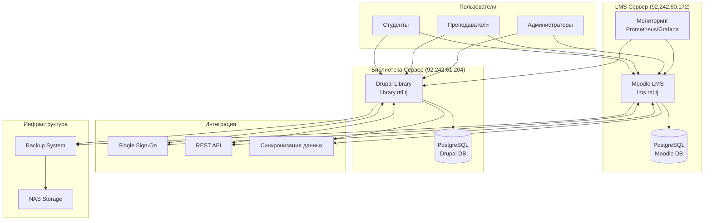

# RTTI LMS Project - Moodle + Drupal Integration

Комплексная система управления обучением для Республиканского института повышения квалификации и переподготовки работников в сфере образования имени А. Джоми (RTTI).

## 🎯 Обзор проекта

Данный проект представляет собой интегрированную LMS систему, состоящую из:

- **Moodle 5.0+** - современная платформа для проведения онлайн-обучения с ИИ инструментами
- **Drupal 11 Library** - цифровая библиотека электронных книг на LTS платформе
- **Облачное развертывание** - автоматическая установка в AWS, DigitalOcean, GCP, Azure
- **Продакшн миграция** - перенос из облака в продакшн с NAS интеграцией
- **Интеграция систем** - единая аутентификация (SSO) и синхронизация данных
- **Система резервного копирования** - многоуровневое резервное копирование с NAS
- **Мониторинг и безопасность** - комплексная система мониторинга и алертов

## 📁 Структура проекта

```
LMS_Drupal/
├── documentation/
│   ├── project-plan.md           # Детальный план проекта  
│   ├── technical-requirements.md # Технические требования (обновлено для v5.0.2/v11)
│   ├── deployment-guide.md       # Полное руководство развертывания
│   └── installation-guide.md     # Пошаговое руководство установки
├── cloud-deployment/
│   ├── install-moodle-cloud.sh   # Автоматическая установка Moodle 5.0+
│   ├── install-drupal-cloud.sh   # Автоматическая установка Drupal 11
│   └── cloud-backup.sh           # Локальное резервное копирование
├── production-deployment/
│   ├── install-moodle-production.sh  # Установка Moodle с NAS интеграцией
│   ├── install-drupal-production.sh  # Установка Drupal с NAS интеграцией  
│   └── nas-backup.sh              # Резервное копирование в NAS
├── migration-tools/
│   └── cloud-to-production.sh     # Миграция из облака в продакшн
├── moodle-integration/
│   ├── moodle_drupal_integration.php     # Модуль интеграции для Moodle
│   └── drupal_moodle_integration.module  # Модуль интеграции для Drupal
├── monitoring/
│   ├── install-prometheus-stack.sh       # Полный стек Prometheus + Grafana + AlertManager
│   ├── install-zabbix.sh                 # Установка Zabbix Server + Agent
│   ├── install-monitoring-agents.sh      # Агенты для дополнительных серверов
│   └── README.md                         # Документация по мониторингу
└── README.md                     # Этот файл
```

## 🚀 Быстрый старт

### Предварительные требования

- Ubuntu Server 24.04 LTS 
- Домены: lms.rtti.tj (92.242.60.172), library.rtti.tj (92.242.61.204)
- NAS сервер для продакшн развертывания
- Базовые знания Linux администрирования

### Готовые серверы RTTI

- **LMS + Мониторинг**: lms.rtti.tj (92.242.60.172)
  - Moodle 5.0.2 LMS
  - Система мониторинга (Prometheus/Grafana)
  
- **Библиотека**: library.rtti.tj (92.242.61.204)
  - Drupal 11 Digital Library

### Установка LMS

#### Установка Moodle 5.0+ на lms.rtti.tj (92.242.60.172)

1. **Обычная установка Moodle**
   ```bash
   wget https://raw.githubusercontent.com/cheptura/LMS_Drupal/main/cloud-deployment/install-moodle-cloud.sh
   chmod +x install-moodle-cloud.sh
   sudo ./install-moodle-cloud.sh
   ```

2. **Переустановка Moodle (если база данных уже существует)**
   ```bash
   # Автоматическая очистка и установка
   sudo ./install-moodle-cloud.sh cleanup
   
   # ИЛИ полная переустановка
   wget https://raw.githubusercontent.com/cheptura/LMS_Drupal/main/cloud-deployment/reinstall-moodle.sh
   chmod +x reinstall-moodle.sh
   sudo ./reinstall-moodle.sh
   ```

#### Установка Drupal 11 на library.rtti.tj (92.242.61.204)

3. **Обычная установка Drupal**
   ```bash
   wget https://raw.githubusercontent.com/cheptura/LMS_Drupal/main/cloud-deployment/install-drupal-cloud.sh
   chmod +x install-drupal-cloud.sh
   sudo ./install-drupal-cloud.sh
   ```

4. **Переустановка Drupal (если база данных уже существует)**
   ```bash
   # Автоматическая очистка и установка
   sudo ./install-drupal-cloud.sh cleanup
   
   # ИЛИ полная переустановка
   wget https://raw.githubusercontent.com/cheptura/LMS_Drupal/main/cloud-deployment/reinstall-drupal.sh
   chmod +x reinstall-drupal.sh
   sudo ./reinstall-drupal.sh
   ```

#### Продакшн развертывание с NAS (альтернативно)

3. **Прямая продакшн установка с NAS интеграцией**
   ```bash
   # Moodle с NAS на lms.rtti.tj
   wget https://raw.githubusercontent.com/cheptura/LMS_Drupal/main/production-deployment/install-moodle-production.sh
   chmod +x install-moodle-production.sh
   sudo ./install-moodle-production.sh
   
   # Drupal с NAS на library.rtti.tj
   wget https://raw.githubusercontent.com/cheptura/LMS_Drupal/main/production-deployment/install-drupal-production.sh
   chmod +x install-drupal-production.sh
   sudo ./install-drupal-production.sh
   ```

## 📊 Система мониторинга

Мониторинг установлен на lms.rtti.tj (92.242.60.172) и отслеживает оба сервера:

### 🔵 Prometheus + Grafana + AlertManager (рекомендуется)
```bash
# Установка на lms.rtti.tj
wget https://raw.githubusercontent.com/cheptura/LMS_Drupal/main/monitoring/install-prometheus-stack.sh
chmod +x install-prometheus-stack.sh
sudo ./install-prometheus-stack.sh
```

**Доступ**: 
- Prometheus: http://lms.rtti.tj:9090
- Grafana: http://lms.rtti.tj:3000
- AlertManager: http://lms.rtti.tj:9093

### 🟠 Zabbix Server + Agent (альтернативное решение)
```bash
# Установка на lms.rtti.tj
wget https://raw.githubusercontent.com/cheptura/LMS_Drupal/main/monitoring/install-zabbix.sh
chmod +x install-zabbix.sh
sudo ./install-zabbix.sh
```

**Доступ**: http://lms.rtti.tj/zabbix

### 🔍 Агенты для library.rtti.tj
```bash
# Установка только агентов на library.rtti.tj
wget https://raw.githubusercontent.com/cheptura/LMS_Drupal/main/monitoring/install-monitoring-agents.sh
chmod +x install-monitoring-agents.sh
sudo ./install-monitoring-agents.sh
```

**Мониторинг включает:**
- 📊 Серверы: lms.rtti.tj + library.rtti.tj
- 🌐 Веб-приложения (Moodle, Drupal, Nginx, PHP-FPM)
- 🗄️ Базы данных (PostgreSQL, Redis)
- 💾 NAS и резервные копии
- 🔒 SSL сертификаты и безопасность
- 🚨 Автоматические алерты

Подробная документация: [monitoring/README.md](monitoring/README.md)

### Детальная документация

Полное руководство по развертыванию см. в [installation-guide.md](documentation/installation-guide.md)

## 📋 Основные функции

### ✅ Moodle 5.0+
- Современные ИИ инструменты и рекомендации
- Создание и управление курсами с расширенной аналитикой
- Система оценок и сертификации нового поколения
- Автоматизация учебных процессов с машинным обучением
- Поддержка SCORM пакетов и H5P контента
- Мобильное приложение с офлайн синхронизацией
- Интеграция с BigBlueButton и видеоконференциями
- Улучшенный пользовательский интерфейс и производительность

### ✅ Drupal 11 Library
- Цифровая библиотека на LTS платформе (поддержка до 2029)
- Расширенный поиск с ИИ-рекомендациями
- Современная система таксономий и метаданных
- API-first архитектура для интеграций
- Поддержка мультимедиа контента
- Адаптивный дизайн и PWA функциональность
- Интеграция с Moodle курсами через REST API

### ✅ Облачная инфраструктура
- Автоматическое развертывание в AWS, DigitalOcean, GCP, Azure
- Динамическое масштабирование ресурсов
- CDN для ускорения загрузки контента
- Автоматические SSL сертификаты Let's Encrypt
- Мониторинг производительности в реальном времени
- Облачные резервные копии с георепликацией

### ✅ Продакшн интеграция с NAS
- Централизованное хранение файлов на NAS
- Автоматическая синхронизация облако ↔ продакшн
- Многоуровневое резервное копирование
- Высокая доступность данных
- Масштабируемое хранилище
- Интеграция с корпоративной инфраструктурой

### ✅ Интеграция
- Single Sign-On (SSO) аутентификация
- Синхронизация пользователей
- Автоматическое добавление ресурсов библиотеки в курсы
- Отслеживание прогресса обучения
- Единая система отчетности

### ✅ Безопасность
- SSL/TLS шифрование
- Защита от атак (Fail2ban)
- Регулярные обновления безопасности
- Мониторинг системы
- Аудит доступа

### ✅ Резервное копирование
- Автоматическое ежедневное резервное копирование БД
- Еженедельное резервное копирование файлов
- Ежемесячное полное резервное копирование
- Хранение на NAS сервере
- Процедуры восстановления

## 🛠️ Технический стек

### Серверное ПО
- **ОС**: Ubuntu Server 24.04 LTS
- **Web-сервер**: Nginx 1.24+
- **PHP**: 8.2+ (Moodle), 8.3+ (Drupal) с необходимыми расширениями
- **База данных**: PostgreSQL 16+
- **Кэширование**: Redis 7+
- **Node.js**: 20+ LTS для современных фронтенд-инструментов

### Платформы
- **Moodle**: 5.0+ (с ИИ инструментами и улучшенной производительностью)
- **Drupal**: 11.x LTS (поддержка до 2029 года)
- **SSL**: Let's Encrypt сертификаты с автообновлением
- **Контейнеризация**: Docker готовность для будущего масштабирования

### Облачные платформы
- **AWS**: EC2, RDS, S3, CloudFront
- **DigitalOcean**: Droplets, Managed Databases, Spaces
- **Google Cloud**: Compute Engine, Cloud SQL, Cloud Storage
- **Azure**: Virtual Machines, Database, Blob Storage

### Инструменты
- **Мониторинг**: Системные скрипты + логирование + облачные метрики
- **Резервное копирование**: Многоуровневые скрипты (облако + NAS)
- **Автоматизация**: Cron задачи + CI/CD готовность
- **Управление**: Drush (Drupal), Moodle CLI, WP-CLI совместимость
- **Развертывание**: Автоматические скрипты для облака и продакшн
- **Миграция**: Специализированные инструменты облако → продакшн

## 📊 Архитектура системы



## 📈 Производительность

### Рекомендуемые характеристики серверов

#### Moodle 5.0.2 сервер
- **CPU**: 4-8 cores (2.4GHz+)
- **RAM**: 16GB (рекомендуется 32GB для продакшн)
- **Storage**: 200GB+ SSD (базовая установка + рост данных)
- **Network**: 1Gbps
- **Cloud**: Поддержка автоскейлинга в облачных платформах

#### Drupal 11 сервер
- **CPU**: 4-6 cores (2.4GHz+)
- **RAM**: 8GB (рекомендуется 16GB для больших библиотек)
- **Storage**: 500GB+ SSD (для хранения мультимедиа контента)
- **Network**: 1Gbps
- **Cloud**: CDN интеграция для глобального доступа

#### NAS интеграция (продакшн)
- **Protocol**: CIFS/SMB 3.0+, NFS 4.1+
- **Capacity**: от 2TB (масштабируемо)
- **Redundancy**: RAID 6 или выше
- **Backup**: Автоматическая репликация
- **Performance**: 10Gbps сетевое подключение

### Ожидаемая нагрузка
- **Одновременные пользователи**: до 1000 (облако), до 500 (продакшн)
- **Курсы**: до 2000+
- **Электронные книги**: до 50,000
- **Мультимедиа контент**: до 10TB
- **API запросов**: до 10,000/час
- **Пиковая нагрузка**: обработка экзаменационных периодов

## 🔧 Администрирование

### Ежедневные задачи
- Мониторинг логов ошибок и производительности
- Проверка дискового пространства и NAS подключений
- Мониторинг облачных ресурсов и расходов
- Проверка автоматических резервных копий
- Анализ метрик пользователей и нагрузки

### Еженедельные задачи
- Проверка резервных копий в облаке и NAS
- Обновления безопасности (автоматические + ручная проверка)
- Анализ отчетов использования и производительности
- Оптимизация базы данных и кэша
- Проверка интеграций между системами

### Ежемесячные задачи
- Полное тестирование восстановления из бэкапов
- Мажорные обновления системы (с тестированием)
- Комплексный аудит безопасности
- Архивирование старых данных в холодное хранилище
- Планирование масштабирования и развития
- Анализ затрат на облачную инфраструктуру

## 📞 Поддержка

### Контакты
- **Техническая поддержка**: tech@rtti.tj
- **Администратор системы**: admin@rtti.tj
- **Поддержка пользователей**: support@rtti.tj

### Документация
- [Руководство администратора](documentation/deployment-guide.md)
- [Пошаговая установка](documentation/installation-guide.md)
- [Технические требования](documentation/technical-requirements.md)
- [Устранение неполадок](documentation/troubleshooting.md)
- [План проекта](documentation/project-plan.md)
- [API документация](documentation/api-docs.md) (в разработке)

### Уровни поддержки

#### Уровень 1 (L1) - Базовая поддержка
- Решение стандартных проблем пользователей
- Сброс паролей
- Помощь с навигацией

#### Уровень 2 (L2) - Техническая поддержка
- Проблемы с курсами и контентом
- Настройка интеграций
- Диагностика производительности

#### Уровень 3 (L3) - Экспертная поддержка
- Серьезные системные проблемы
- Изменения архитектуры
- Разработка новых функций

## 🔄 Обновления и развитие

### Планируемые улучшения
- [ ] Мобильное приложение для библиотеки с офлайн синхронизацией
- [ ] AI-рекомендации курсов и книг на базе ML
- [ ] Расширенная аналитика обучения с предиктивной моделью
- [ ] Интеграция с внешними системами (1С, LDAP, Active Directory)
- [ ] Многоязычная поддержка (русский, таджикский, английский)
- [ ] Микросервисная архитектура для лучшего масштабирования
- [ ] Блокчейн сертификация курсов
- [ ] VR/AR поддержка для иммерсивного обучения
- [ ] Интеграция с IoT устройствами в аудиториях
- [ ] Quantum-ready шифрование для будущей безопасности

### График обновлений
- **Критические патчи безопасности**: В течение 24 часов
- **Плановые обновления безопасности**: Еженедельно
- **Функциональные обновления**: Ежемесячно с тестированием
- **Мажорные версии**: Каждые 6-12 месяцев
- **Миграция платформ**: По LTS циклам (2-3 года)

## 📜 Лицензия

Этот проект разрабатывается для RTTI и содержит интеграцию с открытыми системами:
- Moodle - GPL v3
- Drupal - GPL v2+
- Собственные разработки - All rights reserved RTTI

## 🤝 Участие в разработке

### Процесс разработки
1. Создание задачи в системе управления проектами
2. Разработка в отдельной ветке
3. Code review
4. Тестирование на staging среде
5. Развертывание на production

### Стандарты кодирования
- Следование стандартам Moodle и Drupal
- Документирование всех функций
- Обязательное тестирование
- Следование принципам безопасности

---

## 📋 Checklist готовности к запуску

### Инфраструктура
- [ ] Облачные серверы настроены и оптимизированы
- [ ] Продакшн серверы подготовлены с NAS интеграцией
- [ ] SSL сертификаты установлены и автообновляются
- [ ] Домены корректно настроены с CDN
- [ ] Мониторинг работает в облаке и продакшн
- [ ] Многоуровневое резервное копирование настроено
- [ ] Автоскейлинг настроен в облачной среде
- [ ] Сеть безопасности и файрволы сконфигурированы

### Приложения
- [ ] Moodle 5.0.2 установлен с ИИ модулями
- [ ] Drupal 11 установлен с библиотечными модулями
- [ ] Интеграция SSO функционирует между системами
- [ ] Современные темы и брендинг RTTI применены
- [ ] Все необходимые плагины установлены и настроены
- [ ] API интеграции протестированы и работают
- [ ] Мобильная адаптация проверена
- [ ] Производительность оптимизирована

### Миграция и развертывание
- [ ] Облачное тестирование завершено успешно
- [ ] Данные мигрированы в продакшн через NAS
- [ ] Интеграция облако ↔ продакшн настроена
- [ ] Процедуры отката проверены
- [ ] Синхронизация между средами работает
- [ ] Нагрузочное тестирование пройдено

### Контент
- [ ] Пользователи загружены
- [ ] Курсы созданы
- [ ] Библиотека наполнена
- [ ] Права доступа настроены
- [ ] Тестовые данные проверены

### Документация и обучение
- [ ] Документация подготовлена
- [ ] Администраторы обучены
- [ ] Преподаватели обучены
- [ ] Процедуры поддержки готовы
- [ ] Планы развития утверждены

---

## � Устранение неполадок

### Проблемы установки

#### "ERROR: database 'moodle' already exists"
Эта ошибка возникает при повторной установке Moodle.

**Решение 1 (автоматическое, рекомендуется):**
```bash
sudo ./install-moodle-cloud.sh cleanup
```

**Решение 2 (полная переустановка):**
```bash
wget https://raw.githubusercontent.com/cheptura/LMS_Drupal/main/cloud-deployment/reinstall-moodle.sh
chmod +x reinstall-moodle.sh
sudo ./reinstall-moodle.sh
```

**Решение 3 (ручная очистка):**
```bash
sudo -u postgres psql -c "DROP DATABASE IF EXISTS moodle;"
sudo -u postgres psql -c "DROP USER IF EXISTS moodleuser;"
sudo rm -rf /var/www/html/moodle /var/moodledata
sudo ./install-moodle-cloud.sh
```

#### "ERROR: database 'drupal' already exists"
Аналогичная ошибка для Drupal при повторной установке.

**Решение 1 (автоматическое, рекомендуется):**
```bash
sudo ./install-drupal-cloud.sh cleanup
```

**Решение 2 (полная переустановка):**
```bash
wget https://raw.githubusercontent.com/cheptura/LMS_Drupal/main/cloud-deployment/reinstall-drupal.sh
chmod +x reinstall-drupal.sh
sudo ./reinstall-drupal.sh
```

**Решение 3 (ручная очистка):**
```bash
sudo -u postgres psql -c "DROP DATABASE IF EXISTS drupal;"
sudo -u postgres psql -c "DROP USER IF EXISTS drupaluser;"
sudo rm -rf /var/www/html/drupal
sudo ./install-drupal-cloud.sh
```

#### Ошибки PHP или Nginx
- Проверьте логи: `sudo tail -f /var/log/nginx/error.log`
- Перезапустите службы: `sudo systemctl restart nginx php8.2-fpm php8.3-fpm`
- Проверьте конфигурацию: `sudo nginx -t`

#### Проблемы с правами доступа

**Для Moodle:**
```bash
sudo chown -R www-data:www-data /var/www/html/moodle
sudo chown -R www-data:www-data /var/moodledata
sudo chmod -R 755 /var/www/html/moodle
sudo chmod -R 777 /var/moodledata
```

**Для Drupal:**
```bash
sudo chown -R www-data:www-data /var/www/html/drupal
sudo chmod -R 755 /var/www/html/drupal
sudo chmod -R 777 /var/www/html/drupal/web/sites/default/files
```

### Мониторинг и диагностика
- **Системные ресурсы**: `htop`, `df -h`, `free -m`
- **Логи приложений**: `/var/log/nginx/`, `/var/log/postgresql/`
- **Статус служб**: `systemctl status nginx postgresql redis`

### Полезные скрипты переустановки
- **Moodle**: [cloud-deployment/reinstall-moodle.sh](cloud-deployment/reinstall-moodle.sh)
- **Drupal**: [cloud-deployment/reinstall-drupal.sh](cloud-deployment/reinstall-drupal.sh)
- **Database Fix Guide**: [cloud-deployment/database-fix-guide.md](cloud-deployment/database-fix-guide.md)

---

## �🔗 Полезные ссылки

### RTTI LMS Серверы
- **🎓 Moodle LMS**: [https://lms.rtti.tj](https://lms.rtti.tj) (92.242.60.172)
- **📚 Digital Library**: [https://library.rtti.tj](https://library.rtti.tj) (92.242.61.204)
- **📊 Мониторинг**: [http://lms.rtti.tj:3000](http://lms.rtti.tj:3000) (Grafana)

### Проект
- **🌐 GitHub Repository**: [https://github.com/cheptura/LMS_Drupal](https://github.com/cheptura/LMS_Drupal)
- **🐛 Issues & Support**: [https://github.com/cheptura/LMS_Drupal/issues](https://github.com/cheptura/LMS_Drupal/issues)
- **📖 Wiki**: [https://github.com/cheptura/LMS_Drupal/wiki](https://github.com/cheptura/LMS_Drupal/wiki)
- **🏷️ Releases**: [https://github.com/cheptura/LMS_Drupal/releases](https://github.com/cheptura/LMS_Drupal/releases)

### Документация
- **📋 Installation Guide**: [documentation/installation-guide.md](documentation/installation-guide.md)
- **📊 Monitoring Guide**: [monitoring/README.md](monitoring/README.md)
- **🔧 Technical Requirements**: [documentation/technical-requirements.md](documentation/technical-requirements.md)
- **🚨 Troubleshooting**: [documentation/troubleshooting.md](documentation/troubleshooting.md)

### Платформы
- **Moodle 5.0.2**: [https://moodle.org](https://moodle.org)
- **Drupal 11**: [https://drupal.org](https://drupal.org)
- **Ubuntu 24.04**: [https://ubuntu.com](https://ubuntu.com)

---

**Последнее обновление**: Сентябрь 2025  
**Версия документации**: 3.0 (Moodle 5.0+ + Drupal 11 + Monitoring System)  
**Ответственный**: Команда разработки RTTI LMS  
**Архитектура**: Продакшн готовое решение с современными технологиями
